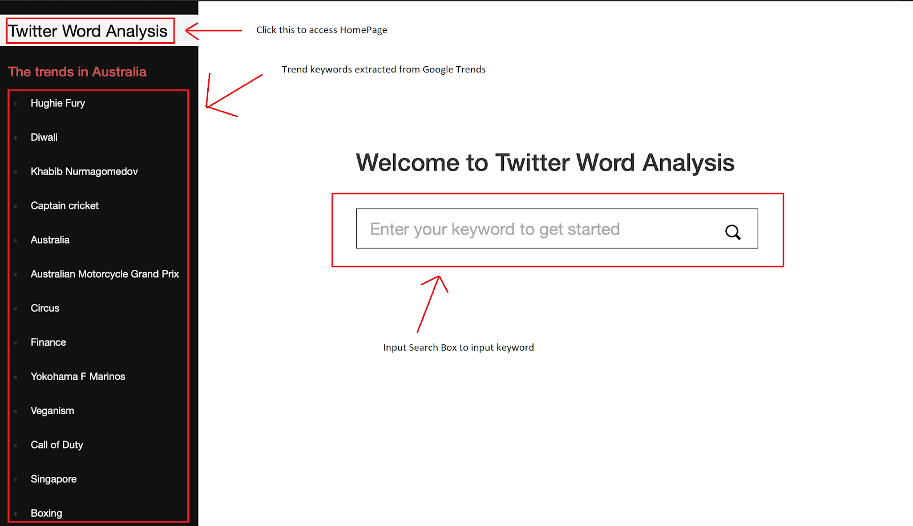
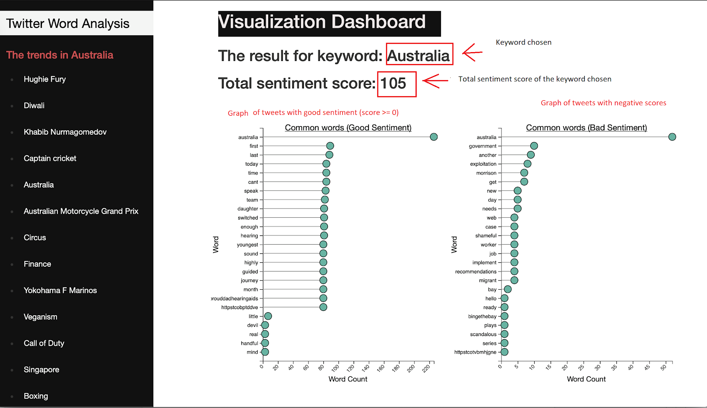

# CAB432 Cloud Assignment

This is the assignment 2 of Unit CAB432 Cloud Computing (Semester 2, 2019). The focus of this assessment task is to explore a scalable, load-balanced cloud application with a stateless architecture.

## Tweet Your Sentiment 

The proposed application will feature a way for users to view the most common search terms commented by users on Twitter. Twitter is a microblogging and social networking service where users post and interact with messages known as "tweets". These tweets can spark opinions of interest relating highly debated topics, allowing other users to discuss, debate and educate others via these tweets. Hashtags are utilised in tweets to categorize that tweet as a topic to allow other users easier access to tweets with the same hashtag.

Interestingly, Twitter has a reputation of displaying dominant perspectives and for its users to also express these common perspectives. Thus this app will allow users to view the most common keywords being discussed in a Twitter hashtag. Upon a users query of a hashtag, tweets will stream in with sentiment analysis being performed on the text to determine if they have positive or negative sentiment. For the respective sentiments, the most common words will be displayed on a bar graph for the user to see.

### Sample Usage 

1. Homepage Website: 
- User can type a keyword in the search input box or click one of trend keywords on the left side to see the results



2. Visualization Dashboard with keyword “Australia”
- Display the results based on the keyword provided. 
- The results include the total sentiment scores of all related tweets and two graphs counting the most common words of tweets with positive & neutral and negative scores. 
- Reload the webpage to get updated result. 



[Read Full Report Here](CAB432_Report.pdf)

### Download Instructions 

Prequisites:

1. Create Azure CosmosDB on Azure 
2. Register the Twitter Developer Account to get API credentials 

Use **Terminal** or **Command Prompt** to run the code 

1. Install [Docker](https://www.docker.com)

```
sudo curl -fsSL https://get.docker.com/ | sh
```

2. Download the folder and go to the directory 

```
git clone https://github.com/tranquanghuy0801/CAB432_Cloud_Computing
cd Assignment2 
```

3. Create the **.env** file in **app/** directory and paste the following into with Twitter API and Azure CosmosDB information 

```
CONSUMER_KEY=********
CONSUMER_SECRET=********
ACCESS_TOKEN=********
ACCESS_TOKEN_SECRET=********
ENDPOINT=******** //endpoint of Azure CosmosDB
PRIMARY_KEY=******** // primary key of Azure CosmosDB
DATABASE=******* // name of CosmoDB Database
TWEET_COLLECTION=******* // name of tweets
TREND_COLLECTION=******* // name of trends collections

```

4. Run the application with Docker Compose that contains main application and Redis 

```
docker-compose build && docker-compose up 
```

5. Run the web localhost 
```
http://localhost:3000 
```
